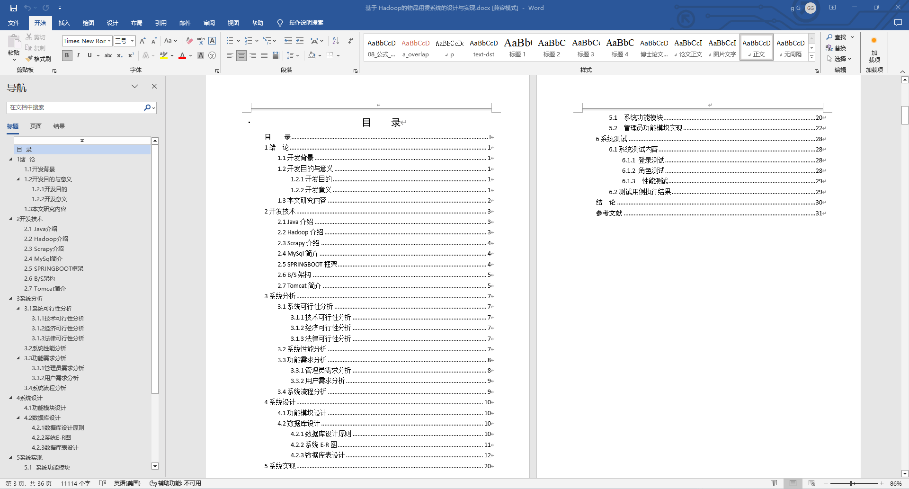

基于SpringBoot的物品租赁系统（程序+论文）
=
- 完整代码获取地址：从戎源码网 ([https://armycodes.com/](https://armycodes.com/))
- 作者微信：19941326836  QQ：952045282 
- 承接计算机毕业设计、Java毕业设计、Python毕业设计、深度学习、机器学习
- 选题+开题报告+任务书+程序定制+安装调试+论文+答辩ppt 一条龙服务
- 所有选题地址https://github.com/nature924/allProject

一、项目介绍
---
基于Spring Boot框架实现的物品租赁系统，系统包含两种角色：管理员、用户,系统分为前台和后台两大模块，主要功能如下。

### 前台：
1. 首页：展示系统的基础信息和操作入口。
2. 公告信息：展示系统的公告信息，包括公告标题、发布时间等。
3. 物品信息：展示系统的物品信息，包括物品名称、价格、押金等。
4. 物品出租：用户可以选择物品进行租赁，包括选择物品数量、租赁时间等。
5. 闲置资讯：展示系统的闲置物品信息，包括闲置物品名称、价格等。

### 后台：
### 管理员：
1. 个人中心：管理员可以管理个人信息，包括修改密码等操作。
2. 用户管理：管理员可以管理用户信息，包括添加、编辑、删除等操作。
3. 公告类型管理：管理员可以管理公告类型，包括添加、编辑、删除等操作。
4. 公告信息管理：管理员可以管理公告信息，包括添加、编辑、删除等操作。
5. 物品类别管理：管理员可以管理物品类别，包括添加、编辑、删除等操作。
6. 物品信息管理：管理员可以管理物品信息，包括添加、编辑、删除等操作。
7. 物品租赁管理：管理员可以管理物品租赁信息，包括查看租赁记录、审核租赁申请等操作。
8. 物品归还管理：管理员可以管理物品归还信息，包括确认归还、计算租金等操作。
9. 评价信息管理：管理员可以管理用户对物品的评价信息，包括查看评价、回复评价等操作。
10. 物品出租管理：管理员可以管理物品的出租信息，包括添加、编辑、删除等操作。
11. 系统管理：管理员可以管理系统的基础数据和配置，包括用户信息、权限管理等。

二、项目技术
---
- 编程语言：Java
- 数据库：MySQL
- 项目管理工具：Maven
- 前端技术：VUE、HTML、Jquery、Bootstrap
- 后端技术：Spring、SpringMVC、MyBatis

三、运行环境
---
- 操作系统：Windows、macOS都可以
- JDK版本：JDK1.8以上都可以
- 开发工具：IDEA、Ecplise、Myecplise都可以
- 数据库: MySQL5.7以上都可以
- Tomcat：任意版本都可以
- Maven：任意版本都可以

四、运行截图
---
### 论文截图：

### 程序截图：

